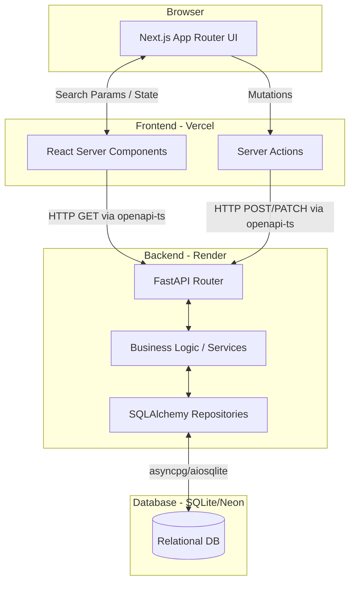

# System Architecture

This document serves as the high-level technical blueprint for the ACME Salary Management application. It is treated as a living document and will be iteratively updated as the system evolves.

## High-Level Diagram

## Architectural Boundaries & Principles

### 1. Frontend (Next.js 16)
- **Server-First approach:** We rely heavily on React Server Components (RSC) to fetch data from the FastAPI backend and render HTML directly.
- **URL-Driven State:** Complex client states (like table pagination, search, and filters) are hoisted to the URL using `searchParams`. This ensures views are deeply linkable, shareable, and avoids complex client-side state synchronization.
- **Server Actions for Mutations:** Form submissions and data mutations (Create, Update, Delete) are handled via Next.js Server Actions, which then make the corresponding HTTP requests to the backend.

### 2. Backend (FastAPI 0.138)
- **Repository Pattern:** The database logic is abstracted behind repository classes (e.g., `EmployeeRepository`). This cleanly separates SQLAlchemy query building from business logic.
- **Service Layer:** Business rules (such as currency conversion or complex validations) live in the Service layer, which orchestrates calls between Repositories.
- **Strict OpenAPI Contracts:** We heavily rely on Pydantic schemas. The resulting `openapi.json` is used by the frontend via `openapi-ts` to automatically generate a fully typed SDK.

### 3. Data Tier (SQLite → Neon PostgreSQL)
- **Current State (MVP):** Local development uses SQLite (`aiosqlite`) for simplicity and speed.
- **Future State:** The schema and migrations (via Alembic) are written to be fully compatible with PostgreSQL. For deployment, the database will migrate to Neon Serverless Postgres.
- **Database Views:** Complex aggregations for analytics (e.g., fetching active employees with latest salaries) are handled via raw SQL Views within the database rather than expensive application-side logic.
