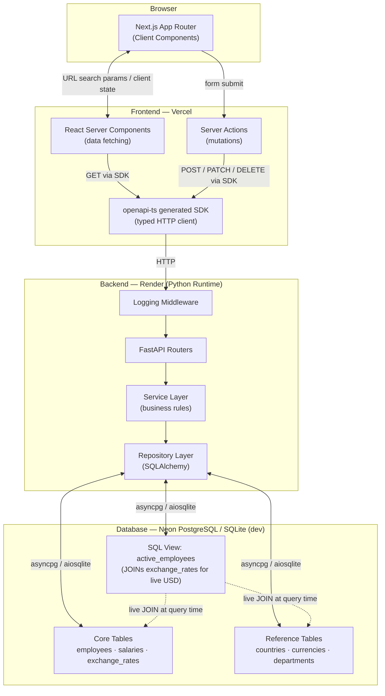
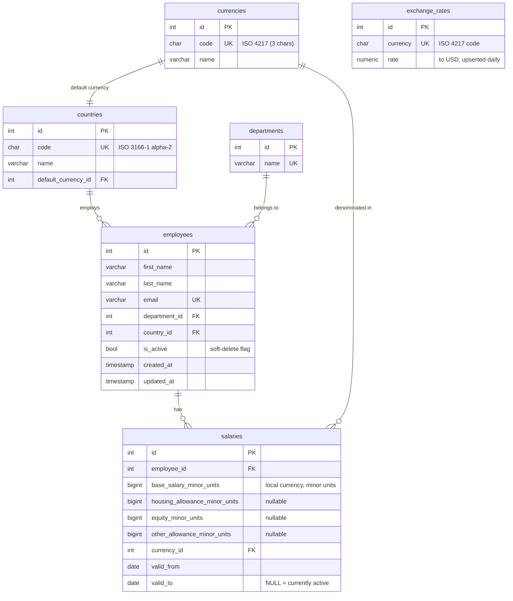
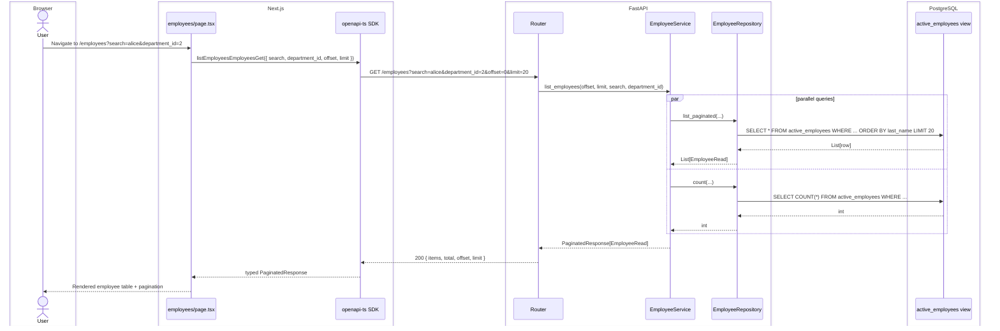
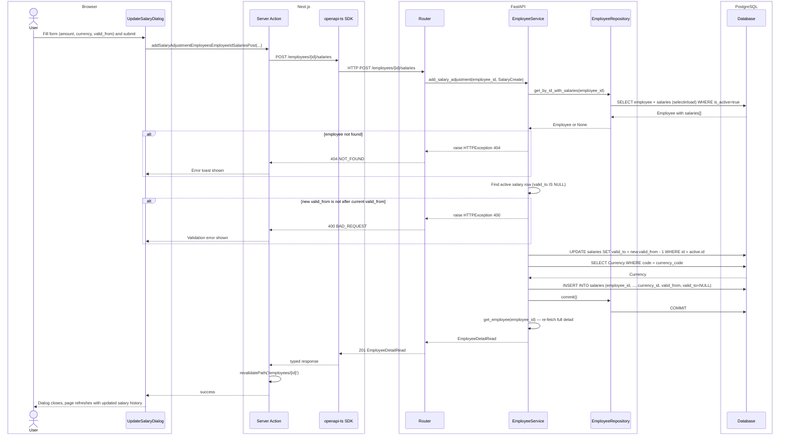
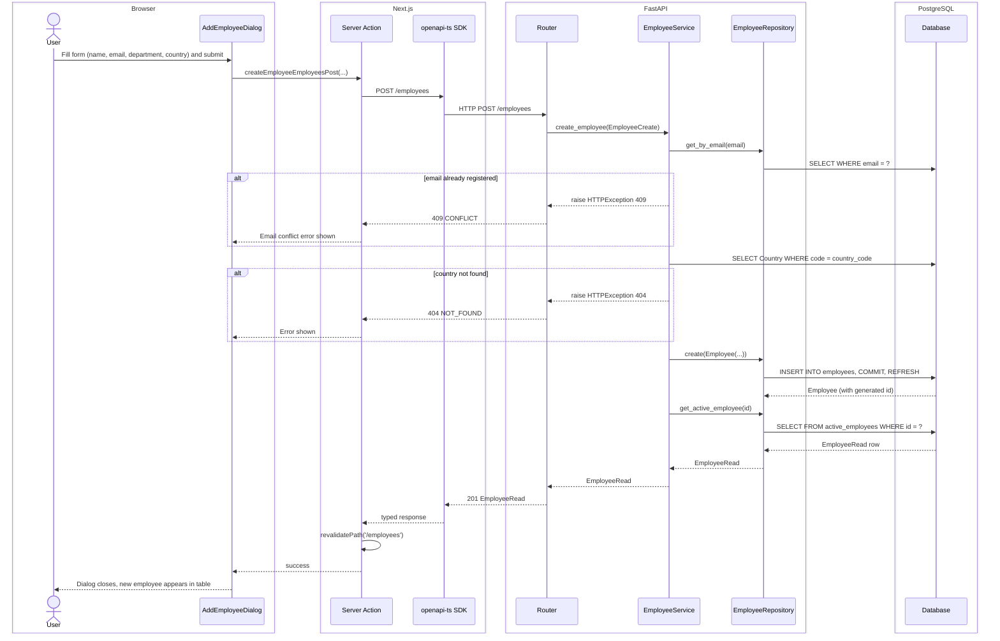
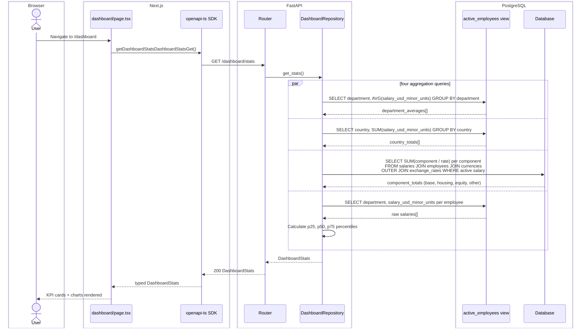
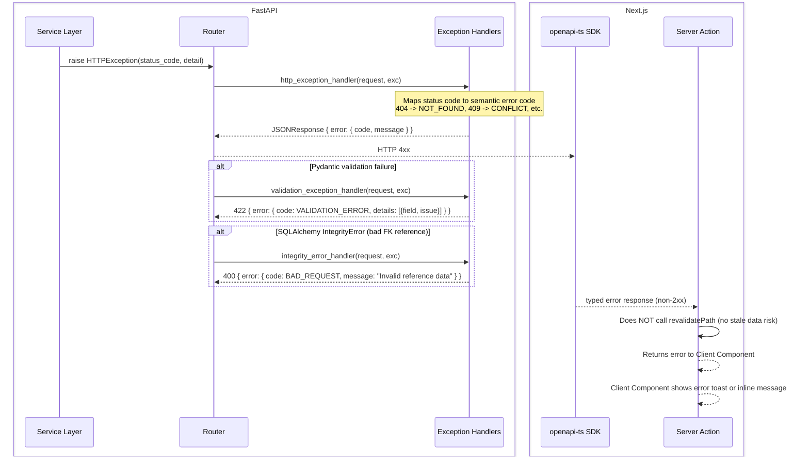
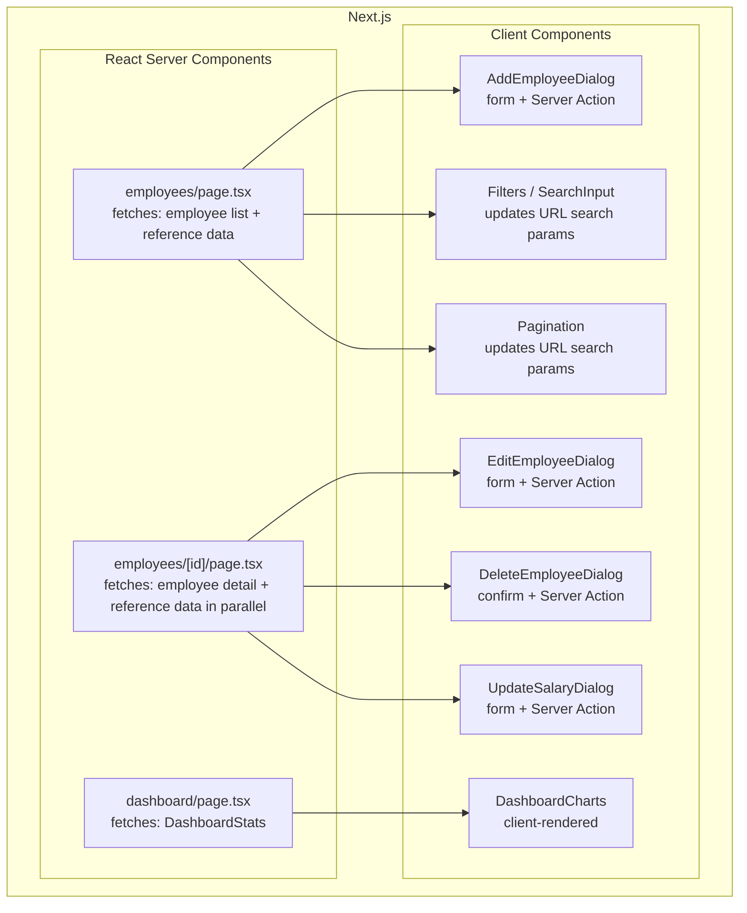
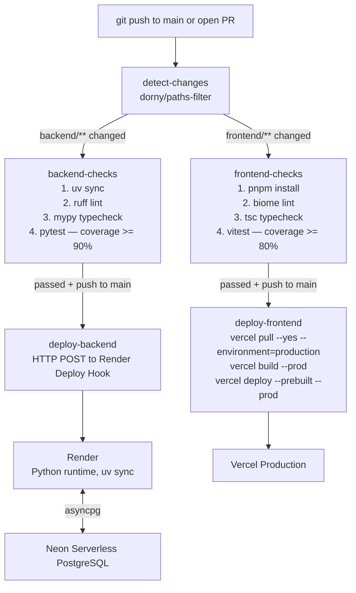

# System Architecture

This document is the high-level technical blueprint for the ACME Salary Management application. It is treated as a living document and is updated as the system evolves.

---

## 1. System Overview

---

## 2. Data Model

### Key Invariants

- **One active salary per employee:** `valid_to = NULL` marks the currently active salary row. Exactly one row per active employee satisfies this condition at any time.
- **Closing on adjustment:** When a new salary is recorded, the service atomically sets `valid_to = new.valid_from - 1 day` on the previous active row before inserting the new one.
- **Minor units everywhere:** All monetary amounts are stored as `BIGINT` integer minor units (e.g. cents) to eliminate floating-point precision bugs.

---

## 3. Sequence Diagrams

### 3a. List Employees (paginated, with filters)

### 3b. Add Salary Adjustment

This is the most complex write path — it closes the current active salary and creates a new one in a single commit.

### 3c. Create Employee

### 3d. Dashboard Load (exchange-rate-aware aggregation)

### 3e. Error Propagation

---

## 4. Frontend Component Boundary

**RSC boundary rules:**
- RSCs own **all data fetching** — they call the openapi-ts SDK with `await` directly in the component body.
- Client Components own **all interactivity** — dialogs, filters, charts, URL manipulation.
- Mutations cross back to the server via **Server Actions**, which call the SDK and then `revalidatePath` on success to invalidate the RSC cache.

---

## 5. CI/CD Pipeline

**Key decisions ([ADR 0008](decisions/0008-ci-cd-pipeline-design.md)):**
- A single `deploy.yml` with a `detect-changes` gate keeps frontend and backend CI/CD fully independent.
- Render is deployed via **Deploy Hook** (not native Git integration) so the CI guard is enforced — Render only deploys after `backend-checks` passes.
- The frontend uses the **3-step Vercel CLI pattern** (`pull → build → deploy --prebuilt`) to separate build failures from upload failures.
- No Docker in production. Both stacks deploy via a single HTTP call or CLI command, with no image artifacts to manage.

---

## 6. Architectural Principles

### Frontend (Next.js)
- **Server-First:** RSCs fetch data and render HTML. The browser receives minimal JavaScript.
- **URL-Driven State:** Pagination, search, and filters live in `searchParams` — views are deep-linkable and require no client-side state synchronization.
- **Server Actions for mutations:** All writes go through Server Actions, which call the typed SDK and invoke `revalidatePath` on success.
- **Type-safe API contract:** `openapi-ts` generates a fully typed SDK from the backend's `openapi.json`. There are no manual `fetch` calls anywhere in the frontend.

### Backend (FastAPI)
- **Repository Pattern:** SQLAlchemy query logic is isolated behind repository classes. Services never build ORM queries directly.
- **Service Layer owns business rules:** Salary closing logic, email uniqueness checks, and currency/country resolution all live exclusively in the service layer — not in routers, not in repositories.
- **Strict Pydantic contracts:** All input/output shapes are Pydantic models. The resulting OpenAPI spec is the single source of truth for the frontend SDK.
- **Structured error envelope:** All 4xx/5xx responses follow `{ error: { code, message } }`. Validation errors additionally include a `details` array with per-field information.

### Data Tier
- **Local currency is the source of truth** ([ADR 0011](decisions/0011-local-currency-source-of-truth.md)): Salaries are stored in the employee's legal contract currency. USD conversion happens dynamically at read time via the `active_employees` view — never frozen at write time.
- **Temporal salary model:** `valid_from` / `valid_to` date ranges on `salaries` provide a full immutable audit trail. The system never overwrites or deletes salary rows.
- **SQL View for analytics:** The `active_employees` view joins `salaries`, `currencies`, `exchange_rates`, `departments`, and `countries` in one place, exposing a flat projection. Application code never assembles this join itself.
