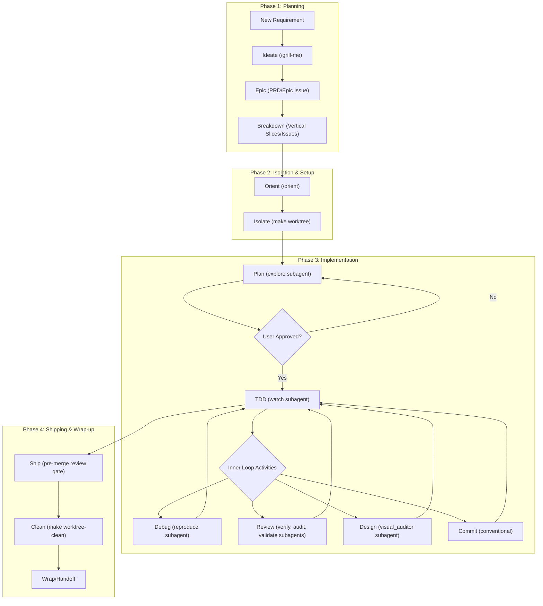

# Development Workflow

This document outlines the agent-assisted development workflow used in this project, designed to maintain high code quality, clear planning, and structured execution. 



---

## 1. New Requirement (Planning Phase)
When a new requirement is introduced, we follow a structured planning process to ensure clarity and scope management before any code is written.

- **Ideate**: We use the `ideate` skill and the `/grill-me` slash command to engage in Socratic dialogue and stress-test ideas. This helps clarify ambiguous requirements, resolve design decisions, and solidify the approach.
- **Epic**: Once the idea is clear, we use the `epic` skill to serialize the conversation into a Product Requirements Document (PRD) and file it as a high-level Epic in GitHub.
- **Breakdown**: Finally, the `breakdown` skill is used to take the Epic and slice it into small, independently-grabbable vertical slices (GitHub Issues). This enables incremental delivery and testability.

## 2. Isolation & Setup Phase
Before starting any implementation work, the developer or agent must orient themselves and isolate their workspace.

- **Orient**: At the start of every session, invoke the `/orient` skill (optionally passing the path to the previous session's handoff file) to get a snapshot of the current active branches, worktrees, recent commits, and assigned issues.
- **Isolate**: Create a dedicated git worktree for the task by running:
  ```bash
  make worktree name=<worktree-name> branch=<branch-name> [PORT_OFFSET=1]
  ```
  This creates an isolated workspace under `_worktrees/<worktree-name>` checking out the feature branch, sets up worktree-specific environment files, configures non-conflicting network ports, and spins up a dedicated SQLite database to avoid process and file locks.

## 3. Implementation Phase
Once the isolated worktree is prepared, transition into execution.

- **Plan**: For a selected issue, we use the `plan` skill. This runs the `explore` subagent to research the frontend/backend codebase, and creates an `implementation_plan.md` artifact. Execution pauses for user approval.
- **Goal-Driven Execution**: For tasks requiring extensive autonomous work, we use the `/goal` slash command. This empowers the agent to work relentlessly and thoroughly until the objective is achieved, without stopping prematurely.
- **TDD (Test-Driven Development)**: Once the plan is approved, we use the `tdd` skill to implement the changes using a red-green-refactor cycle. The agent spins up the `watch` subagent in the background to monitor test suite pass/fail statuses.
- **Inner Loop Activities**: During TDD, we seamlessly integrate other specialized skills and tooling:
  - **Browser (Playwright MCP)**: Use Playwright browser tools within the `visual_auditor` subagent to visually verify UI layout changes, capture screenshots, and check console logs.
  - `review` for automated standards and spec compliance checks.
  - `commit` to logically group and stage changes with conventional commit messages.
  - `debug` for reproducing and diagnosing complex test failures using the `reproduce` subagent.
  - `refactor` to restructure code safely while tests are green.
  - **File-scoped Hooks**: Tool-execution hooks automatically run `biome check` and `ruff check` on every file write to catch lint/type errors immediately.

## 4. Shipping & Wrap-up Phase
At the end of a task or session, we merge our changes and clean up our workspace.

- **Ship**: Runs the `/ship` skill which performs a pre-merge gate check using the `/review` subagents (`verify`, `audit`, `validate`). If successful, it squash-merges the feature branch into `main` and pushes it to trigger production deployment.
- **Clean**: Cleans up the isolated workspace by running:
  ```bash
  make worktree-clean name=<worktree-name>
  ```
  This deletes the worktree and cleans up the branch namespaces.
- **Handoff (Mid-Session)**: If the task is incomplete and context needs to be passed to a new agent or developer session, run the `/handoff` skill to generate a structured relay baton document.
- **Wrap (End-of-Session)**: The `wrap` skill is invoked at the end of a session to scan the conversation for durable project learnings, update ADRs or requirements docs, close completed issues, and output a summary note detailing the exact resume commands for the next session.
- **Learn**: We use the `/learn` slash command to persist any new agent behavioral rules, coding patterns, or skill improvements discovered during the session. This ensures the AI assistant becomes more capable over time.

---

## 5. Subagent Registry & Permissions

This project standardizes dynamic subagent templates under `.agents/subagents/`. The parent agent automatically parses their YAML frontmatter configurations for permissions boundaries and extracts their Markdown body as their system prompts:

| Subagent Name | Template Path | Write Tools | MCP Tools | Workspace Mode | Primary Responsibility |
| :--- | :--- | :---: | :---: | :---: | :--- |
| `explore` | [.agents/subagents/explore.md](../.agents/subagents/explore.md) | `false` | `false` | `inherit` | Codebase exploration and context search. |
| `reproduce` | [.agents/subagents/reproduce.md](../.agents/subagents/reproduce.md) | `true` | `false` | `branch` | Reproduction of bugs by writing/running minimal scripts. |
| `watch` | [.agents/subagents/watch.md](../.agents/subagents/watch.md) | `true` | `false` | `branch` | Background test watching and pass/fail reporting. |
| `verify` | [.agents/subagents/verify.md](../.agents/subagents/verify.md) | `false` | `false` | `inherit` | Auditing git diffs against requirements specifications. |
| `audit` | [.agents/subagents/audit.md](../.agents/subagents/audit.md) | `false` | `false` | `inherit` | Auditing git diffs against code style and FastAPI/React patterns. |
| `validate` | [.agents/subagents/validate.md](../.agents/subagents/validate.md) | `false` | `false` | `inherit` | Auditing git diffs for test coverage and active ADR compliance. |
| `visual_auditor` | [.agents/subagents/visual_auditor.md](../.agents/subagents/visual_auditor.md) | `false` | `true` | `inherit` | Browser rendering layout checks and visual screenshot tests. |

---
*Note: This workflow is supported by custom agent skills located in the `.agents/skills` directory and git hooks, ensuring consistent and reproducible interactions.*
