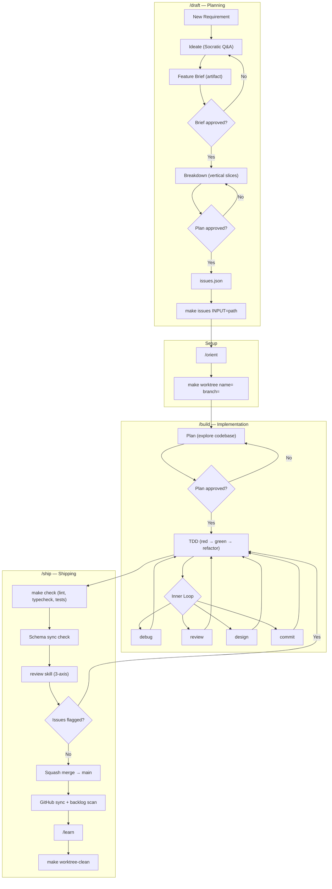

# Development Workflow

This document outlines the agent-assisted development workflow used in this project. Work moves through three workflow phases — **Draft**, **Build**, and **Ship** — with a setup step between planning and implementation.



---

## 1. `/draft` — Planning Phase

Triggered by typing `/draft`. Orchestrates ideation through to a ready-to-execute issue plan.

- **Ideate**: Structured Socratic Q&A covering problem, users, solution shape, scope, technical decisions, testing approach, and risks. One question at a time. The agent explores the codebase rather than asking when a question can be answered by looking.
- **Feature Brief**: The primary output of ideation — a detailed artifact (`feature_brief_<slug>.md`) covering Problem Statement, Solution, User Stories, Implementation Decisions, Testing Decisions, Out of Scope, and Further Notes. The user reviews and approves before breakdown begins.
- **Breakdown**: Slices the Feature Brief into independently-grabbable vertical issues (each delivering a complete path: schema → API → UI → tests). Presents a markdown draft of the full breakdown for review. On approval, writes `issues.json` to the session directory and immediately executes:
  ```bash
  make issues INPUT=<path/to/issues.json>
  ```
  This calls `create_issues.py`, which creates the Epic (or links an existing one), creates child issues in dependency order, and links everything to the GitHub project.

> **Epic resolution**: breakdown fetches all open `epic`-labelled issues and suggests candidates. If one fits, it links to it. If not, it creates a new one. If an epic is explicitly named in the conversation, it uses it directly.

---

## 2. Setup Phase

Before implementation, orient and isolate the workspace.

- **Orient**: At the start of every session, run `/orient` to get a snapshot of active branches, worktrees, recent commits, and assigned issues.
- **Isolate**: Create a dedicated git worktree for the issue:
  ```bash
  make worktree name=<name> branch=<branch> [PORT_OFFSET=1]
  ```
  This creates an isolated workspace under `_worktrees/<name>`, sets up worktree-specific environment files, configures non-conflicting ports, and provisions a dedicated SQLite database.

---

## 3. `/build` — Implementation Phase

Triggered by typing `/build`. Orchestrates planning through to a fully tested implementation.

- **Plan**: The `plan` skill reads the issue, runs the `explore` subagent to research the codebase, and produces an `implementation_plan.md` artifact. Execution pauses for user approval.
- **TDD Loop**: Once approved, the `tdd` skill drives the red → green → refactor cycle. The agent actively runs the loop — it does not hand off to the developer mid-implementation.
- **Inner Loop Activities**: During TDD, specialized skills integrate seamlessly:
  - `debug` — reproduce and diagnose complex failures via the `reproduce` subagent
  - `review` — automated spec compliance and code quality checks
  - `design` — visual layout verification via the `visual_auditor` subagent (Playwright)
  - `commit` — logical grouping with conventional commit messages
  - `refactor` — safe restructuring while tests are green
- **Pre-commit Hooks**: `biome check` and `ruff check` run automatically on every commit.

---

## 4. `/ship` — Shipping Phase

Triggered by typing `/ship`. Runs the full shipping ceremony.

1. **`make check`** — typecheck, lint, and coverage tests. Stops and directs to `/debug` on failure.
2. **Schema sync** — runs `make gen-client`, commits any unstaged OpenAPI changes.
3. **AI Review Gate** — `review` skill performs a 3-axis check: spec alignment, code quality, and test intent. Critical issues block the ship.
4. **Rebase** — fetches and rebases onto `main`.
5. **Squash merge & push** — merges the feature branch into `main` with a conventional commit (`Closes #<id>`), triggers the pre-push test hook and remote build pipeline.
6. **GitHub sync** — posts an outcome summary on the closed issue, scans for deferred backlog items.
7. **`/learn`** — reminder to persist any new agent behaviors or patterns discovered during the session.
8. **Cleanup** — `make worktree-clean name=<name>`.

---

## 5. Supporting Skills

Skills used standalone outside of the three main workflows:

| Skill | Trigger | Purpose |
| :--- | :--- | :--- |
| `orient` | `/orient` | Session bootstrap — active branches, worktrees, recent commits, open issues |
| `commit` | `/commit` | Stage and commit with a conventional message |
| `debug` | `/debug` | Systematic diagnosis for bugs and failing tests |
| `refactor` | `/refactor` | Plan a refactor via interview, file a GitHub issue with the plan |
| `research` | `/research` | Focused codebase or library research |
| `review` | `/review` | 3-axis code review (spec / quality / test intent) |
| `handoff` | `/handoff` | Compact the session into a handoff document for the next agent |
| `ideate` | `/ideate` | Standalone ideation → Feature Brief (without breakdown) |
| `breakdown` | `/breakdown` | Standalone breakdown from an existing Feature Brief |
| `design` | `/design` | Aesthetic and visual design direction |

---

## 6. Subagent Registry

Subagent templates live under `.agents/subagents/`. The parent agent parses their YAML frontmatter for permission boundaries and uses their Markdown body as the system prompt.

| Subagent | Template | Write | MCP | Workspace | Responsibility |
| :--- | :--- | :---: | :---: | :---: | :--- |
| `explore` | [explore.md](../.agents/subagents/explore.md) | ✗ | ✗ | inherit | Codebase exploration and context search |
| `reproduce` | [reproduce.md](../.agents/subagents/reproduce.md) | ✓ | ✗ | branch | Reproduce bugs via minimal scripts |
| `watch` | [watch.md](../.agents/subagents/watch.md) | ✓ | ✗ | branch | Background test watching and reporting |
| `verify` | [verify.md](../.agents/subagents/verify.md) | ✗ | ✗ | inherit | Diff audit against requirements |
| `audit` | [audit.md](../.agents/subagents/audit.md) | ✗ | ✗ | inherit | Diff audit against code style patterns |
| `validate` | [validate.md](../.agents/subagents/validate.md) | ✗ | ✗ | inherit | Diff audit for test coverage and ADR compliance |
| `visual_auditor` | [visual_auditor.md](../.agents/subagents/visual_auditor.md) | ✗ | ✓ | inherit | Browser layout checks and visual screenshots |

---

*Skills live in `.agents/skills/`. Git hooks enforce lint and type checks on every commit.*
